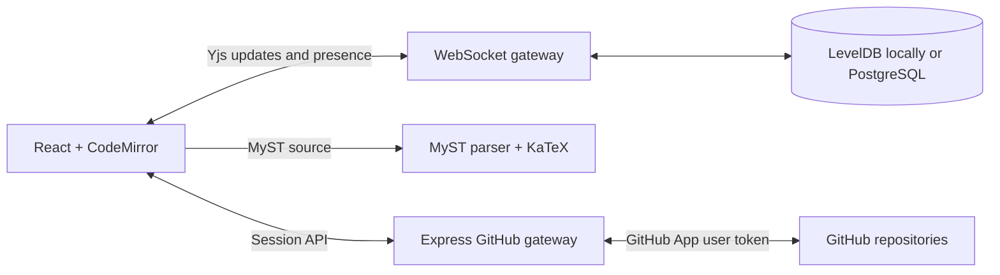

# DeMystify

DeMystify is a real-time collaborative editor for MyST Markdown manuscripts. It combines a CodeMirror source editor, lightweight MyST browser preview, shared cursors and comments, durable Yjs storage, and a GitHub branch/pull-request workflow.

> **Status:** Working research prototype. Use it locally or for controlled single-instance pilots; repository-backed maintainer authorization, capability-based invited roles, and shared PostgreSQL persistence are implemented. The public Replit pilot is online with one Autoscale machine and active cloud-credit monitoring.

[Live pilot](https://demystify--jeromelecoq.replit.app/) · [Project site](https://allenneuraldynamics.github.io/demystify/) · [Intent](docs/INTENT.md) · [Architecture](docs/ARCHITECTURE.md) · [Deployment](docs/DEPLOYMENT.md) · [Replit pilot](docs/REPLIT.md) · [Safe testing](docs/TESTING.md) · [Contributing](CONTRIBUTING.md)

## Features

- Simultaneous conflict-free editing with Yjs and WebSockets
- Live collaborator cursors, presence, and anchored review discussions
- Attributed Visual suggestions with before/after text, maintainer accept/reject, and conflict detection
- Debounced JavaScript MyST preview with safe HTML, repository figures, static iframe placeholders, AuthorshipExtractor rosters, tables, and KaTeX math
- LevelDB-backed local persistence and PostgreSQL-backed production persistence
- GitHub App OAuth with HTTP-only server sessions
- Repository browsing and MyST file loading
- Explicit snapshots to a `demystify/...` branch
- One persisted draft pull request per room, created by the first snapshot
- Revocable Suggestion links with configurable expiration for proposing edits without repository access
- Revocable view-only links with configurable expiration that do not require a GitHub account
- Responsive source, split, and preview modes

## Local Development

Node.js 20.19 or newer is recommended.

```bash
npm install
npm run dev
```

Open http://127.0.0.1:5173. The command runs both Vite and the API/WebSocket server. Maintainers sign in with GitHub and need repository write access. Invited contributors and viewers enter only the room named by their revocable sharing link. Contributors can also sign in with GitHub for verified comment and presence attribution without gaining repository authority.

Server-side GitHub App credentials are required to create maintainer rooms and use repository workflows. Suggestion participants and viewers can join an existing room through an active sharing link without a GitHub account. By default, document updates persist under `.data/yjs`; room ownership and repository bindings persist under `.data/rooms.json`. Set `DATABASE_URL` to exercise the production PostgreSQL stores locally.

## GitHub App Setup

Create a GitHub App under **Settings > Developer settings > GitHub Apps**.

Use these local URLs:

- Homepage URL: `http://127.0.0.1:5173`
- Callback URL: `http://127.0.0.1:5173/api/auth/github/callback`
- Webhooks: not required

Grant these repository permissions:

- **Contents:** Read and write
- **Pull requests:** Read and write
- **Metadata:** Read-only

Install the app only on repositories DeMystify should access. Then configure the server:

```bash
cp .env.example .env
openssl rand -hex 32
```

Put the generated value in `SESSION_SECRET`, then fill in the GitHub App's client ID, client secret, and slug:

```dotenv
GITHUB_CLIENT_ID=Iv1...
GITHUB_CLIENT_SECRET=...
GITHUB_APP_SLUG=your-app-slug
SESSION_SECRET=...
APP_URL=http://127.0.0.1:5173
```

Restart `npm run dev`. The GitHub identity dialog then offers OAuth login to every room role. Maintainers additionally receive the repository picker, which lists repositories available through the app installation.

GitHub credentials remain on the server. The browser receives only user/repository metadata through the application API; it never stores a client secret or personal access token.

## Publishing Workflow

1. Open **GitHub repository** and sign in.
2. Select an installed repository and a `.md` or `.myst` file.
3. Choose **Open file** to load it for all current collaborators, or **Bind current draft** to create/update that path.
4. Select **Save to GitHub** to snapshot the live document onto its stable `demystify/<room>` branch and create its draft pull request.
5. Later snapshots update the same branch and pull request. Open **PR #...** from the workspace or repository dialog to review it in GitHub.
6. Select source text, or leave the cursor in a paragraph, before commenting. Yjs keeps that thread attached while collaborators edit around it. Suggestion participants can instead edit rendered prose to create an attributed before/after proposal without changing canonical source.
7. Maintainers discuss, accept, or reject each proposal. Acceptance uses the original Yjs-relative range and exact source text; a concurrent source change marks the proposal conflicted rather than overwriting it.
8. Comments and suggestions created before the PR exists remain queued until the first changed snapshot. Changed lines can become native GitHub review threads; other records fall back to marked PR conversation comments. Suggestion records retain proposer, decision, before/after text, replies, and hidden idempotency markers.
9. Replies and native review-thread resolution synchronize in both directions while the room is active. DeMystify polls GitHub on focus and every 60 seconds while the page has recent activity.
10. Closing or merging the PR archives the room. Text, comments, suggestions, and review links remain readable, but HTTP and WebSocket writes are rejected. **Start next revision** creates a fresh room and branch binding initialized from the repository's base branch.

## Citations And Visual Editing

Select **Cite** in the authoring toolbar to search the manuscript's local
reference library first, then Crossref by title, author, year, or DOI. Multiple
papers can be inserted as one parenthetical or narrative MyST citation, with
optional MyST prefix and locator/suffix text. New records are deduplicated by DOI and added to a collaborative `references.bib`
beside the bound manuscript (for example, `paper/references.bib` for
`paper/index.md`). Existing BibTeX citation keys and source formatting are
preserved. Citation insertion follows the manuscript's dominant syntax, using
Markdown/Pandoc `@key` forms or MyST `{cite:*}` roles as appropriate; combinations
that Markdown cannot represent safely fall back to roles.

Select **References** to search and inspect the whole library, import or export
standard BibTeX, edit one raw entry, remove uncited entries, or merge unused DOI
duplicates into an explicitly retained key. Destructive operations are blocked
when they would leave an existing manuscript citation unresolved. Collaborative
library edits use an expected-source check, so a stale form cannot overwrite a
change received from another editor.

The same picker is available while editing rendered prose. Visual editing
supports headings and paragraphs with plain text, bold, italic, inline code,
links, line breaks, and atomic citation chips. That includes single-line list
items and blockquotes, admonition and tab body prose, and figure captions while
preserving their surrounding MyST markers. Captions attached to sandboxed iframe
placeholders remain editable as ordinary MyST prose. Tables, math and code blocks,
directive settings, marked multiline blocks, and unsupported inline MyST remain
rendered but read-only, so source syntax is never silently flattened.

For invited Suggestion participants, Visual edits to primary-file headings,
prose, and captions and explicit Source proposals for open MyST files create
pending review records instead of mutating canonical MyST.
Each record carries proposer identity, before/after source, an anchored reply
thread, and a maintainer decision. Pending deletions and insertions render
directly in both the Visual manuscript and Source editor with the proposer's
color and name; selecting either inline change opens its discussion and decision
controls in Review. A Source edit remains a local draft until **Propose change**;
Split and Visual preview that draft without broadcasting it. Incoming canonical
changes rebase a non-overlapping draft, while an overlap stops submission rather
than overwriting either edit. Pending blocks remain editable, so different
reviewers can submit independent alternatives or revise an existing proposal;
accepting one marks alternatives whose anchors it invalidates as conflicted.
References, metadata, YAML project files, publishing, and maintainer decisions
remain read-only for that role. The WebSocket gateway validates incoming
Suggestion updates against a shadow Yjs document and accepts only review records,
replies, presence, and ordinary comment resolution.

When a bibliography is present, **Save to GitHub** creates the manuscript blob,
the managed `.bib` blob, one Git tree, and one commit before advancing the room
branch. A pull request therefore cannot contain a citation without its matching
bibliography entry.

## Publication Projects And Metadata

Select **Metadata** to edit canonical MyST page frontmatter or project-wide
metadata under `project` in the nearest `myst.yml` or `myst.yaml`. Page values
show inherited project defaults and may override them. The form supports title,
subtitle, description, date, keywords, content license, authors, affiliations,
ORCID, corresponding/equal-contributor flags, ROR, and the standard CRediT
roles. YAML comments, ordering, custom fields, site configuration, exports, and
advanced untouched author fields remain in place.

For repository-backed rooms, DeMystify discovers project source files from MyST
export `article`/`articles`, project and export TOCs, JATS `sub_articles`, and
recursive `{include}` directives. An `{authorship-explorer}` directive also
discovers its `authors`, `authors-alt`, and `authors-alt2` YAML dependencies
relative to the containing Markdown file. Repository-local `.md`, `.myst`,
`.yml`, and `.yaml` sources appear in the Files panel and are shared Yjs texts.
Markdown files have a live heading outline and Visual mode; YAML remains in the
source editor so Markdown tools cannot rewrite structured data. Relative preview
assets resolve from the active file.
The first local path in `project.bibliography` is the managed reference library;
when none is configured, DeMystify falls back to a sibling `references.bib`.
The Metadata panel also lists contributors from directive-linked
AuthorshipExtractor YAML as a read-only source, including IDs, ORCID, affiliations,
and CRediT roles. Canonical page and `myst.yml` metadata remain independently editable.

Saving creates one Git tree and commit for all changed manuscript files, the
managed bibliography, and project configuration. GitHub review comments remain
limited to the primary bound manuscript for now; secondary-file comments are
disabled rather than attached to an incorrect path. The browser preview still
uses the lightweight MyST parser and does not execute project plugins, templates,
or build-time code. For AuthorshipExtractor specifically, it parses only the
collaborative repository YAML and renders a bounded static roster; the plugin's
interactive views continue to run only in the repository's full MyST build.

GitHub is the durable review history; Yjs handles keystroke-level collaboration between commits.

## Sharing Access

The **Share** dialog presents three explicit roles:

- **Maintainer:** a GitHub-authenticated repository writer. Maintainers edit the room, bind repositories, manage sharing, save snapshots, update the draft pull request, and mirror queued comments to GitHub. The shareable Maintainer URL is the plain room URL: it carries no capability and grants access only after GitHub verifies write permission to the bound repository.
- **Suggestion mode:** an invited person with a revocable Suggestion link can comment, draft explicit Source proposals for MyST files, and propose edits to rendered headings, prose, and captions in the primary file without repository access. Split previews local Source drafts; proposed insertion/deletion markup and attribution stay visible in both Visual and Source, and selecting either surface opens the Review discussion. Canonical source changes only when a maintainer accepts a proposal. Concurrent alternatives remain independent, while rejected and conflicted proposals remain in review history. Links may expire after 7, 30, or 90 days, or have no expiration. GitHub sign-in is optional but recommended so presence, comments, proposals, and replies use `Name (@handle)` attribution.
- **Viewer:** anyone with a separately revocable viewer link using the same expiration options. Viewers receive live text, preview, comments, and presence but cannot modify room state.

Suggestion and viewer links use independent secrets in the URL fragment, exchange them once for role-specific HTTP-only sessions, and remove them from the address bar. The server stores only SHA-256 token hashes. Suggestion-mode WebSockets accept only presence, synchronization, valid new comments or pending suggestions, replies, and ordinary comment resolution; canonical source/configuration/reference updates and suggestion decisions are rejected. Viewer WebSockets accept only awareness and initial synchronization. Repository binding, snapshots, pull requests, sharing administration, revisions, and GitHub comment APIs remain maintainer-only. Rotating or revoking one link closes only sockets using that role.

## Architecture



The Express server hosts GitHub routes and upgrades `/collaboration/<room>` connections on the same HTTP server. Vite proxies both paths during development.

## Commands

```bash
npm run dev                 # Web app + API/WebSocket watch mode
npm test                    # Unit tests
npm run test:collaboration  # Self-contained auth + two-client convergence test
npm run test:e2e:quick      # Chromium browser tests against isolated localhost services
npm run test:e2e            # Chromium, Firefox, WebKit, and mobile browser matrix
npm run test:bundle         # Gzip budget for an existing production build
npm run lint                # ESLint
npm run build               # Client/server typecheck + production bundle
npm start                   # Serve dist and WebSockets in production mode
```

Run `npx playwright install chromium firefox webkit` once before the complete
local browser matrix. The browser suite starts isolated services on ports 4173
and 8791, enables only the guarded test-auth routes, and never targets the Replit
deployment. See [Testing](docs/TESTING.md) for coverage and update procedures.

## Production Notes

- Set `APP_URL` to the public HTTPS origin and use the same OAuth callback in the GitHub App.
- Set a strong `SESSION_SECRET`; production cookies are `Secure`, `HttpOnly`, and `SameSite=Lax`.
- Configure `DATABASE_URL`, or the standard `PGHOST`, `PGDATABASE`, `PGUSER`, and `PGPASSWORD` variables. Production refuses to start without PostgreSQL.
- PostgreSQL stores server sessions, immutable room bindings, and Yjs updates. Local LevelDB and JSON storage remain development fallbacks.
- Preserve WebSocket upgrades for `/collaboration/`; the included Cloud Run configuration sends them directly to the application.
- Keep the Cloud Run maximum at one instance until a cross-instance Pub/Sub channel is implemented.
- Hidden browser tabs and visible pages without interaction for 10 minutes disconnect their collaboration WebSocket and pause GitHub polling. Yjs state remains mounted locally, and pointer, keyboard, scroll, focus, or visibility activity reconnects before synchronization resumes. This prevents abandoned tabs from holding request-based compute active indefinitely.
- Paper search uses the public Crossref REST API through the server. Set the optional `CROSSREF_MAILTO` environment variable to identify production requests to Crossref's polite pool.
- Room bindings are enforced during HTTP claims and WebSocket upgrades. Broad production use still needs backups, audit retention, rate limits, metrics, and operational review.
- Viewer-link rotation and revocation invalidate anonymous sessions and disconnect active viewer sockets immediately.
- Repository permission changes take effect for new room claims and WebSocket reconnects. Established sockets are not continuously reauthorized.

Rendered MyST HTML is sanitized with DOMPurify. OAuth requests use a per-session state value. Production dependencies are audited; MyST's plugins use a tested compatibility shim for the patched `markdown-it` release.

Collaborative text uses LF internally so CodeMirror and Yjs share character offsets. GitHub snapshots restore the source file's LF, CRLF, or CR style. Persisted rooms finish hydration before the server completes the WebSocket handshake and starts Yjs synchronization.

## Current MVP Boundaries

- The browser preview is a fast reading aid, not an authoritative publication build. It renders the open file after a short pause, resolves committed public-repository figures, substitutes static iframe placeholders, and provides a data-backed static fallback for AuthorshipExtractor. Remote plugin code, custom site styles, generated assets, and interactive figures remain the responsibility of repository CI and the full MyST build.
- GitHub only permits native inline review threads on lines represented in the PR diff. Threads on unchanged or outdated source use grouped PR conversation comments; GitHub displays those fallback replies as a flat conversation.
- GitHub-to-DeMystify synchronization currently uses polling. A production multi-instance deployment should replace or supplement it with authenticated GitHub webhooks.
- Attributed suggestions currently cover Visual edits to headings, supported prose, and captions in the primary MyST file. Arbitrary source-editor tracked changes, insertions outside an editable block, and secondary-file suggestions are not implemented yet.
- Each bound room owns one primary manuscript path, its discovered project sources, one working branch, and one pull request. Closed and merged rooms are server-enforced read-only; the next revision starts in a fresh pre-bound room.
- PostgreSQL is shared, but live Yjs updates are not yet broadcast between application instances. The deployment is therefore limited to one instance.
- An actively used collaborative tab maintains a WebSocket by design and therefore keeps request-based compute active. Idle suspension limits forgotten-tab cost, but sustained external collaboration still needs an explicit cloud budget and monitoring.
- Fork bindings support file loading and snapshots, but automatic pull requests are disabled because GitHub may target the parent repository. Use a standalone repository for isolated PR tests.