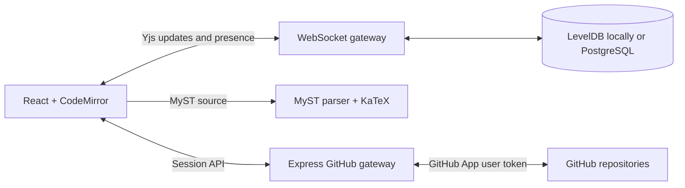

# DeMystify

DeMystify is a real-time collaborative editor for MyST Markdown manuscripts. It combines a CodeMirror source editor, lightweight MyST browser preview, shared cursors and comments, durable Yjs storage, and a GitHub branch/pull-request workflow.

> **Status:** Working research prototype. Use it locally or for controlled single-instance pilots; repository-backed authorization and shared PostgreSQL persistence are implemented.

[Live pilot](https://demystify-deploy--jlecoq.replit.app/) · [Project site](https://allenneuraldynamics.github.io/demystify/) · [Intent](docs/INTENT.md) · [Architecture](docs/ARCHITECTURE.md) · [Deployment](docs/DEPLOYMENT.md) · [Replit pilot](docs/REPLIT.md) · [Safe testing](docs/TESTING.md) · [Contributing](CONTRIBUTING.md)

## Features

- Simultaneous conflict-free editing with Yjs and WebSockets
- Live collaborator cursors, presence, and shared comments
- Debounced JavaScript MyST preview with safe HTML, repository figures, static iframe placeholders, tables, and KaTeX math
- LevelDB-backed local persistence and PostgreSQL-backed production persistence
- GitHub App OAuth with HTTP-only server sessions
- Repository browsing and MyST file loading
- Explicit snapshots to a `demystify/...` branch
- One persisted draft pull request per room, created by the first snapshot
- Revocable, expiring view-only links that do not require a GitHub account
- Responsive source, split, and preview modes

## Local Development

Node.js 20.19 or newer is recommended.

```bash
npm install
npm run dev
```

Open http://127.0.0.1:5173. The command runs both Vite and the API/WebSocket server. Every collaborator signs in with GitHub. A room owner binds the document to a repository, and only users with write access to that repository can join its WebSocket room.

GitHub credentials are required for collaborative rooms. By default, document updates persist under `.data/yjs`; room ownership and repository bindings persist under `.data/rooms.json`. Set `DATABASE_URL` to exercise the production PostgreSQL stores locally.

## GitHub App Setup

Create a GitHub App under **Settings > Developer settings > GitHub Apps**.

Use these local URLs:

- Homepage URL: `http://127.0.0.1:5173`
- Callback URL: `http://127.0.0.1:5173/api/auth/github/callback`
- Webhooks: not required

Grant these repository permissions:

- **Contents:** Read and write
- **Pull requests:** Read and write
- **Metadata:** Read-only

Install the app only on repositories DeMystify should access. Then configure the server:

```bash
cp .env.example .env
openssl rand -hex 32
```

Put the generated value in `SESSION_SECRET`, then fill in the GitHub App's client ID, client secret, and slug:

```dotenv
GITHUB_CLIENT_ID=Iv1...
GITHUB_CLIENT_SECRET=...
GITHUB_APP_SLUG=your-app-slug
SESSION_SECRET=...
APP_URL=http://127.0.0.1:5173
```

Restart `npm run dev`. The GitHub dialog will then offer OAuth login and show only repositories where the app is installed.

GitHub credentials remain on the server. The browser receives only user/repository metadata through the application API; it never stores a client secret or personal access token.

## Publishing Workflow

1. Open **GitHub repository** and sign in.
2. Select an installed repository and a `.md` or `.myst` file.
3. Choose **Open file** to load it for all current collaborators, or **Bind current draft** to create/update that path.
4. Select **Save to GitHub** to snapshot the live document onto its stable `demystify/<room>` branch and create its draft pull request.
5. Later snapshots update the same branch and pull request. Open **PR #...** from the workspace or repository dialog to review it in GitHub.
6. Select source text, or leave the cursor in a paragraph, before commenting. Yjs keeps that thread attached while collaborators edit around it.
7. Comments created before the PR exists remain queued until the first changed snapshot. Changed lines become native GitHub review threads; unchanged lines fall back to marked PR conversation comments with path, lines, and quoted context.
8. Replies and native review-thread resolution synchronize in both directions while the room is open. DeMystify polls GitHub on focus and every 15 seconds.
9. Closing or merging the PR archives the room. Text, comments, and review links remain readable, but HTTP and WebSocket writes are rejected. **Start next revision** creates a fresh room and branch binding initialized from the repository's base branch.

## Citations And Visual Editing

Select **Cite** in the authoring toolbar to search the manuscript's local
reference library first, then Crossref by title, author, year, or DOI. Multiple
papers can be inserted as one parenthetical or narrative MyST citation. New
records are deduplicated by DOI and added to a collaborative `references.bib`
beside the bound manuscript (for example, `paper/references.bib` for
`paper/index.md`). Existing BibTeX citation keys and source formatting are
preserved.

The same picker is available while editing a rendered paragraph. Visual editing
supports plain text, bold, italic, inline code, links, line breaks, and atomic
citation chips. Blocks containing unsupported inline MyST remain rendered but
read-only, so source syntax is never silently flattened.

When a bibliography is present, **Save to GitHub** creates the manuscript blob,
the `references.bib` blob, one Git tree, and one commit before advancing the room
branch. A pull request therefore cannot contain a citation without its matching
bibliography entry.

GitHub is the durable review history; Yjs handles keystroke-level collaboration between commits.

## Sharing Access

The **Share** dialog offers two distinct links:

- **Collaborator link:** opens the manuscript immediately in read-only mode. The recipient can choose **Sign in to edit**; DeMystify upgrades the same room session only if GitHub confirms write access to the bound repository.
- **Viewer link:** grants anonymous, read-only access to live text, preview, comments, and presence. The room owner can choose 7, 30, or 90 days, or no expiration, and can rotate or revoke the link at any time.

Both link types use independent secrets in the URL fragment, exchange them once for role-specific HTTP-only sessions, and remove them from the address bar. The server stores only SHA-256 token hashes. Anonymous HTTP mutations are rejected, and each anonymous WebSocket accepts presence and synchronization requests but rejects Yjs document updates. Viewer links never show an edit or sign-in action; collaborator links show only **Sign in to edit**. Editors remain writable in the same room.

## Architecture



The Express server hosts GitHub routes and upgrades `/collaboration/<room>` connections on the same HTTP server. Vite proxies both paths during development.

## Commands

```bash
npm run dev                 # Web app + API/WebSocket watch mode
npm test                    # Unit tests
npm run test:collaboration  # Self-contained auth + two-client convergence test
npm run lint                # ESLint
npm run build               # Client/server typecheck + production bundle
npm start                   # Serve dist and WebSockets in production mode
```

## Production Notes

- Set `APP_URL` to the public HTTPS origin and use the same OAuth callback in the GitHub App.
- Set a strong `SESSION_SECRET`; production cookies are `Secure`, `HttpOnly`, and `SameSite=Lax`.
- Configure `DATABASE_URL`, or the standard `PGHOST`, `PGDATABASE`, `PGUSER`, and `PGPASSWORD` variables. Production refuses to start without PostgreSQL.
- PostgreSQL stores server sessions, immutable room bindings, and Yjs updates. Local LevelDB and JSON storage remain development fallbacks.
- Preserve WebSocket upgrades for `/collaboration/`; the included Cloud Run configuration sends them directly to the application.
- Keep the Cloud Run maximum at one instance until a cross-instance Pub/Sub channel is implemented.
- Paper search uses the public Crossref REST API through the server. Set the optional `CROSSREF_MAILTO` environment variable to identify production requests to Crossref's polite pool.
- Room bindings are enforced during HTTP claims and WebSocket upgrades. Broad production use still needs backups, audit retention, rate limits, metrics, and operational review.
- Viewer-link rotation and revocation invalidate anonymous sessions and disconnect active viewer sockets immediately.
- Repository permission changes take effect for new room claims and WebSocket reconnects. Established sockets are not continuously reauthorized.

Rendered MyST HTML is sanitized with DOMPurify. OAuth requests use a per-session state value. Production dependencies are audited; MyST's plugins use a tested compatibility shim for the patched `markdown-it` release.

Collaborative text uses LF internally so CodeMirror and Yjs share character offsets. GitHub snapshots restore the source file's LF, CRLF, or CR style. Persisted rooms finish hydration before the server completes the WebSocket handshake and starts Yjs synchronization.

## Current MVP Boundaries

- The browser preview is a fast reading aid, not an authoritative publication build. It renders the open file after a short pause, resolves committed public-repository figures, and substitutes static iframe placeholders. Repository plugins, bibliography, custom site styles, generated assets, and interactive figures remain the responsibility of repository CI and the full MyST build.
- GitHub only permits native inline review threads on lines represented in the PR diff. Threads on unchanged or outdated source use grouped PR conversation comments; GitHub displays those fallback replies as a flat conversation.
- GitHub-to-DeMystify synchronization currently uses polling. A production multi-instance deployment should replace or supplement it with authenticated GitHub webhooks.
- Suggestion/tracked-change mode is not implemented yet.
- Each bound room owns one manuscript path, working branch, and pull request. Closed and merged rooms are server-enforced read-only; the next revision starts in a fresh pre-bound room.
- PostgreSQL is shared, but live Yjs updates are not yet broadcast between application instances. The deployment is therefore limited to one instance.
- Fork bindings support file loading and snapshots, but automatic pull requests are disabled because GitHub may target the parent repository. Use a standalone repository for isolated PR tests.