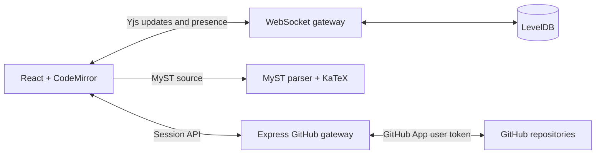

# DeMystify

DeMystify is a real-time collaborative editor for MyST Markdown manuscripts. It combines a CodeMirror source editor, live MyST publication preview, shared cursors and comments, durable Yjs storage, and a GitHub branch/pull-request workflow.

> **Status:** Working research prototype. Use it locally or for controlled pilots; repository-backed authorization and shared production persistence are still planned.

[Project site](https://allenneuraldynamics.github.io/demystify/) · [Intent](docs/INTENT.md) · [Architecture](docs/ARCHITECTURE.md) · [Deployment](docs/DEPLOYMENT.md) · [Safe testing](docs/TESTING.md) · [Contributing](CONTRIBUTING.md)

## Features

- Simultaneous conflict-free editing with Yjs and WebSockets
- Live collaborator cursors, presence, and shared comments
- Official JavaScript MyST parsing with directives, figures, tables, and KaTeX math
- LevelDB-backed document persistence
- GitHub App OAuth with HTTP-only server sessions
- Repository browsing and MyST file loading
- Explicit snapshots to a `demystify/...` branch
- Pull-request creation without personal access tokens
- Responsive source, split, and preview modes

## Local Development

Node.js 20.19 or newer is recommended.

```bash
npm install
npm run dev
```

Open http://127.0.0.1:5173. The command runs both Vite and the API/WebSocket server. New documents receive an unguessable room ID in the URL; sharing that URL joins the same live document.

The editor works locally without GitHub credentials. Document updates persist under `.data/yjs`.

## GitHub App Setup

Create a GitHub App under **Settings > Developer settings > GitHub Apps**.

Use these local URLs:

- Homepage URL: `http://127.0.0.1:5173`
- Callback URL: `http://127.0.0.1:5173/api/auth/github/callback`
- Webhooks: not required

Grant these repository permissions:

- **Contents:** Read and write
- **Pull requests:** Read and write
- **Metadata:** Read-only

Install the app only on repositories DeMystify should access. Then configure the server:

```bash
cp .env.example .env
openssl rand -hex 32
```

Put the generated value in `SESSION_SECRET`, then fill in the GitHub App's client ID, client secret, and slug:

```dotenv
GITHUB_CLIENT_ID=Iv1...
GITHUB_CLIENT_SECRET=...
GITHUB_APP_SLUG=your-app-slug
SESSION_SECRET=...
APP_URL=http://127.0.0.1:5173
```

Restart `npm run dev`. The GitHub dialog will then offer OAuth login and show only repositories where the app is installed.

GitHub credentials remain on the server. The browser receives only user/repository metadata through the application API; it never stores a client secret or personal access token.

## Publishing Workflow

1. Open **GitHub repository** and sign in.
2. Select an installed repository and a `.md` or `.myst` file.
3. Choose **Open file** to load it for all current collaborators, or **Bind current draft** to create/update that path.
4. Select **Save to GitHub** to snapshot the live document onto its stable `demystify/<room>` branch.
5. Open the repository dialog and select **Pull request** to save once more and create or reopen the review PR.

GitHub is the durable review history; Yjs handles keystroke-level collaboration between commits.

## Architecture



The Express server hosts GitHub routes and upgrades `/collaboration/<room>` connections on the same HTTP server. Vite proxies both paths during development.

## Commands

```bash
npm run dev                 # Web app + API/WebSocket watch mode
npm test                    # Unit tests
npm run test:collaboration  # Two-client Yjs convergence test; server required
npm run lint                # ESLint
npm run build               # Client/server typecheck + production bundle
npm start                   # Serve dist and WebSockets in production mode
```

## Production Notes

- Set `APP_URL` to the public HTTPS origin and use the same OAuth callback in the GitHub App.
- Set a strong `SESSION_SECRET`; production cookies are `Secure`, `HttpOnly`, and `SameSite=Lax`.
- Put a reverse proxy in front of the server and preserve WebSocket upgrades for `/collaboration/`.
- Replace the default in-memory Express session store with Redis or another shared store before scaling beyond one process.
- LevelDB is suitable for one server. A multi-instance deployment needs shared Yjs persistence and pub/sub.
- Collaboration URLs currently act as bearer invitations. Add organization membership or explicit room ACL checks in the WebSocket upgrade handler for regulated/private deployments.

Rendered MyST HTML is sanitized with DOMPurify. OAuth requests use a per-session state value. Production dependencies are audited; MyST's plugins use a tested compatibility shim for the patched `markdown-it` release.

## Current MVP Boundaries

- Comments apply to the document rather than a selected text range.
- Suggestion/tracked-change mode is not implemented yet.
- The included session and Yjs stores are designed for a single application instance.
- Collaboration rooms currently use unguessable links rather than GitHub repository ACLs.
- Fork bindings support file loading and snapshots, but automatic pull requests are disabled because GitHub may target the parent repository. Use a standalone repository for isolated PR tests.