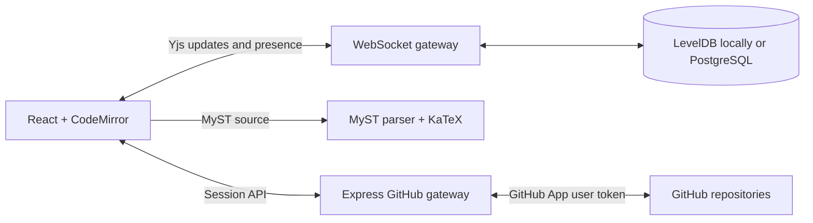

# DeMystify

DeMystify is a real-time collaborative editor for MyST Markdown manuscripts. It combines a CodeMirror source editor, lightweight MyST browser preview, shared cursors and comments, durable Yjs storage, and a GitHub branch/pull-request workflow.

> **Status:** Working research prototype. Use it locally or for controlled single-instance pilots; repository-backed authorization and shared PostgreSQL persistence are implemented.

[Project site](https://allenneuraldynamics.github.io/demystify/) · [Intent](docs/INTENT.md) · [Architecture](docs/ARCHITECTURE.md) · [Deployment](docs/DEPLOYMENT.md) · [Replit pilot](docs/REPLIT.md) · [Safe testing](docs/TESTING.md) · [Contributing](CONTRIBUTING.md)

## Features

- Simultaneous conflict-free editing with Yjs and WebSockets
- Live collaborator cursors, presence, and shared comments
- Official JavaScript MyST parsing with directives, figures, tables, and KaTeX math
- LevelDB-backed local persistence and PostgreSQL-backed production persistence
- GitHub App OAuth with HTTP-only server sessions
- Repository browsing and MyST file loading
- Explicit snapshots to a `demystify/...` branch
- One persisted draft pull request per room, created by the first snapshot
- Responsive source, split, and preview modes

## Local Development

Node.js 20.19 or newer is recommended.

```bash
npm install
npm run dev
```

Open http://127.0.0.1:5173. The command runs both Vite and the API/WebSocket server. Every collaborator signs in with GitHub. A room owner binds the document to a repository, and only users with write access to that repository can join its WebSocket room.

GitHub credentials are required for collaborative rooms. By default, document updates persist under `.data/yjs`; room ownership and repository bindings persist under `.data/rooms.json`. Set `DATABASE_URL` to exercise the production PostgreSQL stores locally.

## GitHub App Setup

Create a GitHub App under **Settings > Developer settings > GitHub Apps**.

Use these local URLs:

- Homepage URL: `http://127.0.0.1:5173`
- Callback URL: `http://127.0.0.1:5173/api/auth/github/callback`
- Webhooks: not required

Grant these repository permissions:

- **Contents:** Read and write
- **Pull requests:** Read and write
- **Metadata:** Read-only

Install the app only on repositories DeMystify should access. Then configure the server:

```bash
cp .env.example .env
openssl rand -hex 32
```

Put the generated value in `SESSION_SECRET`, then fill in the GitHub App's client ID, client secret, and slug:

```dotenv
GITHUB_CLIENT_ID=Iv1...
GITHUB_CLIENT_SECRET=...
GITHUB_APP_SLUG=your-app-slug
SESSION_SECRET=...
APP_URL=http://127.0.0.1:5173
```

Restart `npm run dev`. The GitHub dialog will then offer OAuth login and show only repositories where the app is installed.

GitHub credentials remain on the server. The browser receives only user/repository metadata through the application API; it never stores a client secret or personal access token.

## Publishing Workflow

1. Open **GitHub repository** and sign in.
2. Select an installed repository and a `.md` or `.myst` file.
3. Choose **Open file** to load it for all current collaborators, or **Bind current draft** to create/update that path.
4. Select **Save to GitHub** to snapshot the live document onto its stable `demystify/<room>` branch and create its draft pull request.
5. Later snapshots update the same branch and pull request. Open **PR #...** from the workspace or repository dialog to review it in GitHub.

GitHub is the durable review history; Yjs handles keystroke-level collaboration between commits.

## Architecture



The Express server hosts GitHub routes and upgrades `/collaboration/<room>` connections on the same HTTP server. Vite proxies both paths during development.

## Commands

```bash
npm run dev                 # Web app + API/WebSocket watch mode
npm test                    # Unit tests
npm run test:collaboration  # Self-contained auth + two-client convergence test
npm run lint                # ESLint
npm run build               # Client/server typecheck + production bundle
npm start                   # Serve dist and WebSockets in production mode
```

## Production Notes

- Set `APP_URL` to the public HTTPS origin and use the same OAuth callback in the GitHub App.
- Set a strong `SESSION_SECRET`; production cookies are `Secure`, `HttpOnly`, and `SameSite=Lax`.
- Configure `DATABASE_URL`, or the standard `PGHOST`, `PGDATABASE`, `PGUSER`, and `PGPASSWORD` variables. Production refuses to start without PostgreSQL.
- PostgreSQL stores server sessions, immutable room bindings, and Yjs updates. Local LevelDB and JSON storage remain development fallbacks.
- Preserve WebSocket upgrades for `/collaboration/`; the included Cloud Run configuration sends them directly to the application.
- Keep the Cloud Run maximum at one instance until a cross-instance Pub/Sub channel is implemented.
- Room bindings are enforced during HTTP claims and WebSocket upgrades. Broad production use still needs backups, audit retention, rate limits, metrics, and operational review.
- Repository permission changes take effect for new room claims and WebSocket reconnects. Established sockets are not continuously reauthorized.

Rendered MyST HTML is sanitized with DOMPurify. OAuth requests use a per-session state value. Production dependencies are audited; MyST's plugins use a tested compatibility shim for the patched `markdown-it` release.

Collaborative text uses LF internally so CodeMirror and Yjs share character offsets. GitHub snapshots restore the source file's LF, CRLF, or CR style. Persisted rooms finish hydration before the server completes the WebSocket handshake and starts Yjs synchronization.

## Current MVP Boundaries

- Comments apply to the document rather than a selected text range.
- Suggestion/tracked-change mode is not implemented yet.
- Each bound room owns one manuscript path, working branch, and pull request. A merged revision starts in a new room.
- PostgreSQL is shared, but live Yjs updates are not yet broadcast between application instances. The deployment is therefore limited to one instance.
- Fork bindings support file loading and snapshots, but automatic pull requests are disabled because GitHub may target the parent repository. Use a standalone repository for isolated PR tests.