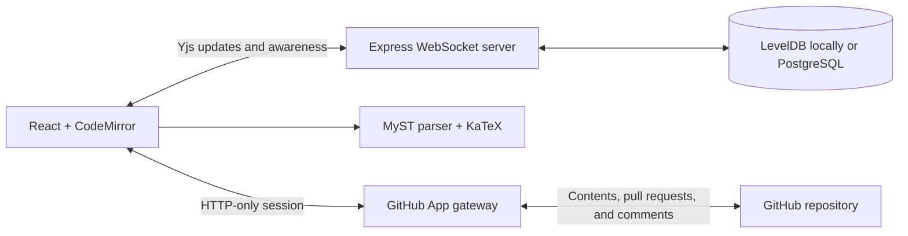
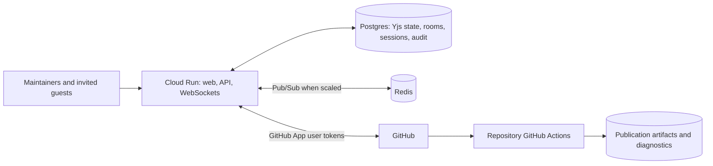

# Architecture

## Current Implementation

The browser binds CodeMirror directly to a shared `Y.Text`. The same Yjs document stores comments, while awareness carries transient cursors and collaborator identities. The Express server handles both API requests and WebSocket upgrades. Every upgrade is authorized from either a maintainer's HTTP-only GitHub session or an active room-scoped sharing grant; maintainer upgrades also recheck repository write access before handing the connection to Yjs. Hidden tabs and visible pages without interaction for 10 minutes disconnect their provider and pause GitHub polling while retaining local Yjs state. Pointer, keyboard, scroll, focus, or visibility activity reconnects the provider, so abandoned tabs do not keep request-based compute active indefinitely.

Sharing has three roles, while GitHub identity is an independent session property. A **maintainer** is authenticated through GitHub and has repository write access. The shareable Maintainer URL is the plain room URL and grants no authority by itself; each maintainer claim and HTTP mutation verifies current repository permission. Established maintainer WebSockets are not continuously reauthorized, so permission changes take effect for live editing at reconnect. **Suggestion mode** uses a room-scoped 256-bit capability and may mutate the live `workingContent` root and review discussion without repository access. For each incoming Yjs update, the WebSocket gateway applies the update to a shadow document, verifies protected roots and comment ownership, and stamps working-text attribution from the authorized socket actor rather than client-supplied identity. Suggestion users may authenticate with GitHub so that actor becomes `github:<id>`; OAuth does not upgrade their role unless the repository permission check also succeeds. Anonymous share grants receive stable per-session actor IDs and display names. A **viewer** holds an independent capability and may receive awareness and synchronization but cannot submit Yjs updates. Capability secrets live only in URL fragments, are exchanged for versioned HTTP-only room grants, and are stored only as SHA-256 hashes with creation and optional expiration times. Canonical source, checkpoint decisions, repository binding, snapshots, pull requests, revisions, sharing administration, and GitHub comment APIs require maintainer access. Both editor and contributor sockets enforce that only a comment or reply author may change its body; all writable roles may add replies. Rotating, revoking, or expiring one capability closes only sockets using that role.

Local development uses LevelDB for Yjs updates, an atomic JSON room registry, and in-memory sessions. When PostgreSQL is configured, one shared pool backs sessions, immutable room ownership and repository bindings, and append-only Yjs updates. With either persistence backend, the server finishes hydration before completing the WebSocket handshake; a room is compacted to one current-state update when its last socket disconnects. Production fails closed if PostgreSQL is absent.

The browser uses the official JavaScript MyST parser for fast, debounced feedback. Rendering is memoized and waits briefly for typing to pause, so comment drafts and unrelated UI changes do not reparse a long manuscript. Safe raw HTML is restored before final DOMPurify sanitization; relative images resolve to committed public-repository assets; iframe directives use static placeholders while retaining editable body captions. The AuthorshipExtractor directive has a built-in static fallback that parses only collaborative repository YAML. This preview intentionally does not execute a repository's full `myst.yml`, remote plugin code, custom styles, or generated-asset pipeline. As a result, repositories using custom plugins, templates, or generated assets must treat their CI build output—not the browser preview—as authoritative.

Room bindings are immutable after their first primary repository file is selected. This prevents an existing socket population authorized for one repository from being silently carried into another project. The primary manuscript has an accepted `content` Y.Text and a live `workingContent` Y.Text. Contributors and suggesting maintainers bind Source and Visual to working text; viewers read it; direct maintainer Editing binds canonical text. When accepted and working text are synchronized, the server mirrors direct canonical edits into working text without suggestion attribution. Once working diverges, Editing is disabled until a maintainer accepts or rejects the proposal. Canonical secondary Markdown sources discovered from MyST exports, TOCs, and recursive includes, plus YAML dependencies referenced by AuthorshipExtractor, are nested Y.Text values in a `projectFiles` Y.Map and remain outside the primary-file Suggesting model. The nearest `myst.yml`/`myst.yaml`, its exact repository path, and the managed bibliography path are shared room state as well.

Publication metadata edits operate directly on standard page frontmatter or the `project` object in the discovered MyST config. The YAML Document model preserves comments, key order, and unrelated configuration. MyST validators, ORCID normalization, and the CRediT taxonomy validate form output. One expected-source check covers the active page and project config, so a stale form cannot partially overwrite either source.

GitHub is updated only through explicit snapshots. The gateway derives the repository, path, base branch, and stable `demystify/<room>` branch from the authorized immutable room binding. The first snapshot writes the manuscript, managed bibliography, MyST config, and discovered secondary sources through one Git tree commit, creates a draft pull request, and persists that review identity on the room. Later snapshots update the same branch and pull request. Legacy rooms discover an existing open PR by their deterministic branch before persisting it.

Every room claim, mutation, and WebSocket upgrade refreshes the persisted PR by number and verifies its repository, head branch, and base branch. A closed or merged PR makes the room terminal. Mutation routes return `409`, and the WebSocket server permits only presence and Yjs sync requests so archived content remains loadable without accepting document updates. Starting the next revision creates a server-generated room with the same manuscript binding and initializes its empty Yjs document from the base-branch file.

Comments, replies, proposal contributors, and proposal checkpoints remain part of the shared Yjs document. Comment roots store encoded relative positions against accepted or working text plus quoted context; replies are independent map entries so concurrent replies merge without replacing each other. CodeMirror binds directly to the selected Y.Text. Visual editing keeps its safe MyST block mounted and commits each ProseMirror document transaction through a refreshed relative anchor, so Source and Visual update other sessions before the editor is closed. Review computes whitespace-preserving word hunks from accepted and working source instead of inserting duplicate alternatives into the document.

The server records each socket actor that changes working text in `proposalContributors`. A maintainer accepts or rejects the entire current working state atomically. Acceptance copies working text to `content`; rejection resets working text to accepted source. Both create an immutable `proposalHistory` checkpoint with before/after source, contributors, decision maker, and time. Git submission is blocked while roots differ. The next maintainer snapshot names unsubmitted contributors in its commit message and writes the resulting commit SHA back to accepted checkpoints. Legacy immutable suggestion records are projected once when initializing `workingContent`, then retained as historical review data.

Once a room has a persisted pull request, a connected maintainer resolves anchors to source lines and mirrors each queued root through a maintainer-authorized server route. Suggestion-authored records remain durable in Yjs/PostgreSQL while no maintainer is connected. GitHub bodies retain proposer identity, escaped before/after text, current status, decision-maker/time, replies, and hidden idempotency markers even though the maintainer's OAuth identity performs the API call. GitHub accepts native review threads only on PR diff lines; a `422` response falls back to a marked conversation comment containing path, lines, and quote. Accepted and rejected native threads are resolved through GraphQL. Recently active maintainer browsers poll room/review and comment-sync endpoints on focus and every 60 seconds; inactive pages do not poll.

## Production Target

Production rooms should be keyed by GitHub installation, repository, branch, and manuscript path. The current upgrade path validates the signed-in user and current repository permission, and production uses PostgreSQL instead of the local room and session stores.

Each manuscript repository owns its pinned MyST build and runs it in GitHub Actions for the immutable snapshot commit. DeMystify should remain an observer: show check status and links to diagnostics or artifacts without executing repository code. The browser parser remains useful for instant unsnapshotted feedback while repository CI remains authoritative.

## Data Boundaries

- **GitHub:** canonical manuscript versions, branches, reviews, and publication CI
- **Yjs store:** uncommitted collaborative state
- **Session store:** server-side GitHub user authorization in PostgreSQL
- **GitHub Actions artifacts:** disposable publication output keyed by snapshot commit
- **Audit store:** room membership, snapshots, and attribution events

## Scaling

One application instance is sufficient for a controlled pilot. PostgreSQL makes state durable, but multiple instances still require Pub/Sub so users connected to different instances observe the same live updates. Cloud Run WebSockets reconnect after their configured request timeout; clients must treat reconnects as normal operation.