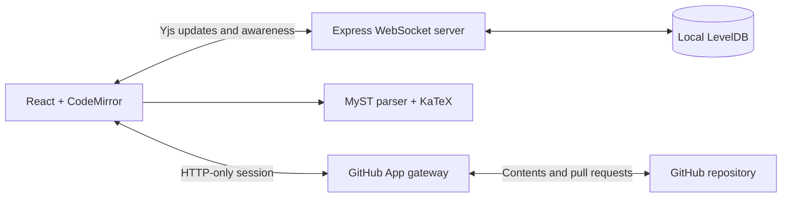
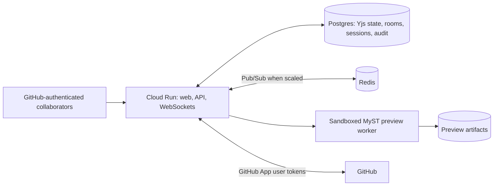

# Architecture

## Current Prototype

The browser binds CodeMirror directly to a shared `Y.Text`. The same Yjs document stores comments, while awareness carries transient cursors and GitHub identities. The Express server handles both API requests and WebSocket upgrades. It parses the HTTP-only GitHub session during every upgrade and verifies repository write access before handing the connection to Yjs. Local LevelDB persists Yjs updates, while an atomic JSON registry persists room ownership and repository bindings.

The browser uses the official JavaScript MyST parser for immediate feedback. This preview is intentionally lightweight and does not yet execute a repository's full `myst.yml`, plugins, bibliography, or generated-asset pipeline.

Room bindings are immutable after their first repository file is selected. This prevents an existing socket population authorized for one repository from being silently carried into another repository's document; changing files requires a new room.

GitHub is updated only through explicit snapshots. The gateway creates a stable `demystify/<room>` branch, writes the manuscript through the Contents API, and creates or reopens a pull request.

## Production Target

Production rooms should be keyed by GitHub installation, repository, branch, and manuscript path. The current upgrade path already validates the signed-in user and current repository permission; production replaces the local room and session stores with shared managed storage.

A repository-aware preview worker should check out the bound revision, overlay the live manuscript, and run the repository's pinned MyST build. The browser parser remains useful for instant feedback while the authoritative preview builds asynchronously.

## Data Boundaries

- **GitHub:** canonical manuscript versions, branches, reviews, and publication CI
- **Yjs store:** uncommitted collaborative state
- **Session store:** encrypted or server-side GitHub user authorization
- **Preview storage:** disposable build artifacts keyed by source revision
- **Audit store:** room membership, snapshots, and attribution events

## Scaling

One application instance is sufficient for a controlled pilot. Multiple instances require shared persistence and Pub/Sub so users connected to different instances observe the same updates. Cloud Run WebSockets reconnect after their configured request timeout; clients must treat reconnects as normal operation.