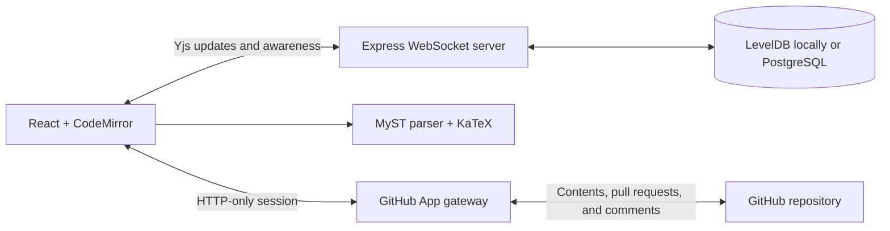
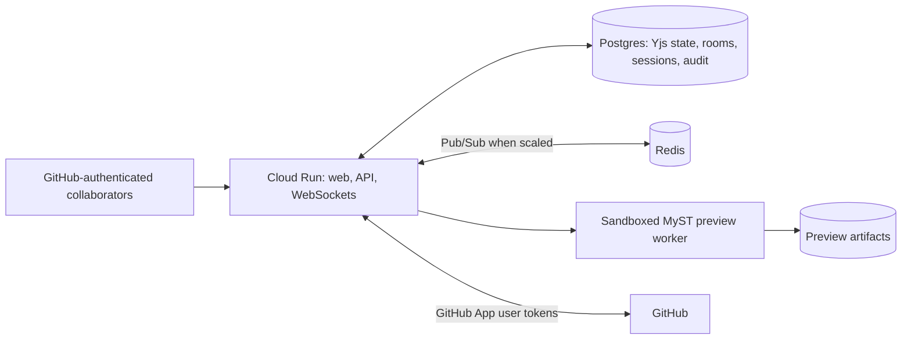

# Architecture

## Current Implementation

The browser binds CodeMirror directly to a shared `Y.Text`. The same Yjs document stores comments, while awareness carries transient cursors and GitHub identities. The Express server handles both API requests and WebSocket upgrades. It parses the HTTP-only GitHub session during every upgrade and verifies repository write access before handing the connection to Yjs. Hidden tabs disconnect their provider and pause GitHub polling, then reconnect when visible, so abandoned tabs do not keep request-based compute and PostgreSQL continuously active.

Anonymous sharing links are capability-based and role-specific. Independent 256-bit collaborator and viewer secrets live only in URL fragments and are exchanged for versioned HTTP-only room grants; PostgreSQL or the local room registry stores only SHA-256 hashes, creation times, and optional expirations. Both anonymous roles are read-only at the HTTP and WebSocket layers. A collaborator grant may become an editor only after GitHub OAuth and repository write authorization; a viewer grant remains view-only even if that browser later signs in. Rotating, revoking, or expiring one capability closes only sockets using that role without affecting editors or the other anonymous role.

Local development uses LevelDB for Yjs updates, an atomic JSON room registry, and in-memory sessions. When PostgreSQL is configured, one shared pool backs sessions, immutable room ownership and repository bindings, and append-only Yjs updates. With either persistence backend, the server finishes hydration before completing the WebSocket handshake; a room is compacted to one current-state update when its last socket disconnects. Production fails closed if PostgreSQL is absent.

The browser uses the official JavaScript MyST parser for immediate feedback. Rendering is memoized and waits briefly for typing to pause, so comment drafts and unrelated UI changes do not reparse a long manuscript. Safe raw HTML is restored before final DOMPurify sanitization; relative images resolve to committed public-repository assets; iframe directives use static placeholders while retaining editable body captions. The AuthorshipExtractor directive has a built-in static fallback that parses only collaborative repository YAML. This preview intentionally does not execute a repository's full `myst.yml`, remote plugin code, custom styles, or generated-asset pipeline.

Room bindings are immutable after their first primary repository file is selected. This prevents an existing socket population authorized for one repository from being silently carried into another project. The primary manuscript remains the backward-compatible `content` Y.Text. Canonical secondary Markdown sources discovered from MyST exports, TOCs, and recursive includes, plus YAML dependencies referenced by AuthorshipExtractor, are nested Y.Text values in a `projectFiles` Y.Map. YAML is source-only in the client but otherwise uses the same live collaboration and atomic snapshot path. The nearest `myst.yml`/`myst.yaml`, its exact repository path, and the managed bibliography path are shared room state as well.

Publication metadata edits operate directly on standard page frontmatter or the `project` object in the discovered MyST config. The YAML Document model preserves comments, key order, and unrelated configuration. MyST validators, ORCID normalization, and the CRediT taxonomy validate form output. One expected-source check covers the active page and project config, so a stale form cannot partially overwrite either source.

GitHub is updated only through explicit snapshots. The gateway derives the repository, path, base branch, and stable `demystify/<room>` branch from the authorized immutable room binding. The first snapshot writes the manuscript, managed bibliography, MyST config, and discovered secondary sources through one Git tree commit, creates a draft pull request, and persists that review identity on the room. Later snapshots update the same branch and pull request. Legacy rooms discover an existing open PR by their deterministic branch before persisting it.

Every room claim, mutation, and WebSocket upgrade refreshes the persisted PR by number and verifies its repository, head branch, and base branch. A closed or merged PR makes the room terminal. Mutation routes return `409`, and the WebSocket server permits only presence and Yjs sync requests so archived content remains loadable without accepting document updates. Starting the next revision creates a server-generated room with the same manuscript binding and initializes its empty Yjs document from the base-branch file.

Comments remain part of the shared Yjs document. Roots store encoded Yjs relative positions and quoted context; replies are independent entries in a second Yjs map so concurrent replies merge without replacing each other. Deleted source collapses an anchor into an orphan while preserving its original quote.

Once a room has a persisted pull request, the browser resolves anchors to source lines and mirrors each root through a room-authorized server route. GitHub accepts native review threads only on PR diff lines; a `422` response falls back to a marked conversation comment containing path, lines, and quote. Hidden thread/message UUIDs make retries idempotent. Native replies use GitHub's `in_reply_to` API, and review-thread resolution uses GraphQL. The browser polls the authorized room sync endpoint on focus and every 15 seconds to import GitHub replies and resolution into deterministic Yjs records.

## Production Target

Production rooms should be keyed by GitHub installation, repository, branch, and manuscript path. The current upgrade path validates the signed-in user and current repository permission, and production uses PostgreSQL instead of the local room and session stores.

A repository-aware preview worker should check out the bound revision, overlay the live manuscript, and run the repository's pinned MyST build. The browser parser remains useful for instant feedback while the authoritative preview builds asynchronously.

## Data Boundaries

- **GitHub:** canonical manuscript versions, branches, reviews, and publication CI
- **Yjs store:** uncommitted collaborative state
- **Session store:** server-side GitHub user authorization in PostgreSQL
- **Preview storage:** disposable build artifacts keyed by source revision
- **Audit store:** room membership, snapshots, and attribution events

## Scaling

One application instance is sufficient for a controlled pilot. PostgreSQL makes state durable, but multiple instances still require Pub/Sub so users connected to different instances observe the same live updates. Cloud Run WebSockets reconnect after their configured request timeout; clients must treat reconnects as normal operation.